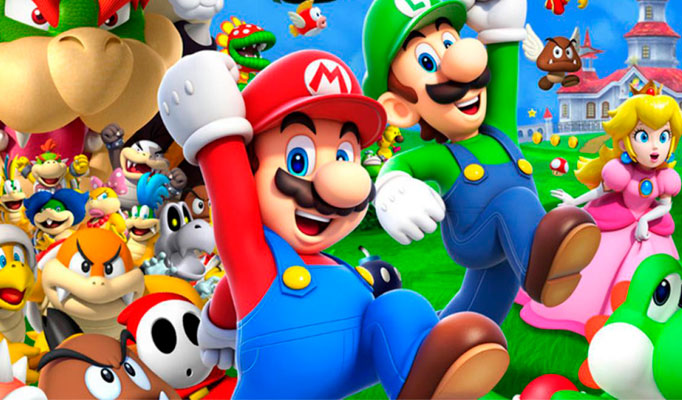

# Welcome to my frontend app  

  
Contenido

  <ol>
    <li><a href="#objetivo">Objetivo</a></li>
    <li><a href="#deploy">Deploy</a></li>
    <li><a href="#imagenes">Imágenes</a></li>
    <li><a href="#licencia">Licencia</a></li>
    <li><a href="#webgrafia">Webgrafia</a></li>
    <li><a href="#lenguajes">Lenguajes</a></li>
    <li><a href="#contacto">Contacto</a></li>
  </ol>

## Objetivo
Crear una consola en HTML y CSS  
  
## Deploy

    <a href="https://roekan.github.io/FED-29-05--Proyecto-Consola-/"><strong>Url a producción </strong></a>

## Imagenes
Previsualización 
 
Fondo de pantalla 
 
Imagenes de ejemplo para crearlo 
 

## Licencia
Este proyecto se encuentra bajo licencia de Álvaro Fernández Arribas

## Webgrafia:
Para conseguir mi objetivo he recopilado información de:

- Google imágenes buscando la Nintendo switch

Otras webs utilizadas en el proyecto:

- <a href="https://pickcoloronline.com/"><strong>Obtener códigos de color </strong></a>
- <a href="https://cssgradient.io/"><strong>Hacer los degradados de color </strong></a>
- <a href="https://www.iconhunt.site/"><strong>Obteción de iconos </strong></a>

## Lenguajes:

HTML - Para la maquetación general de la switch
CSS - Para los estilos de HTML

## Contacto

 

